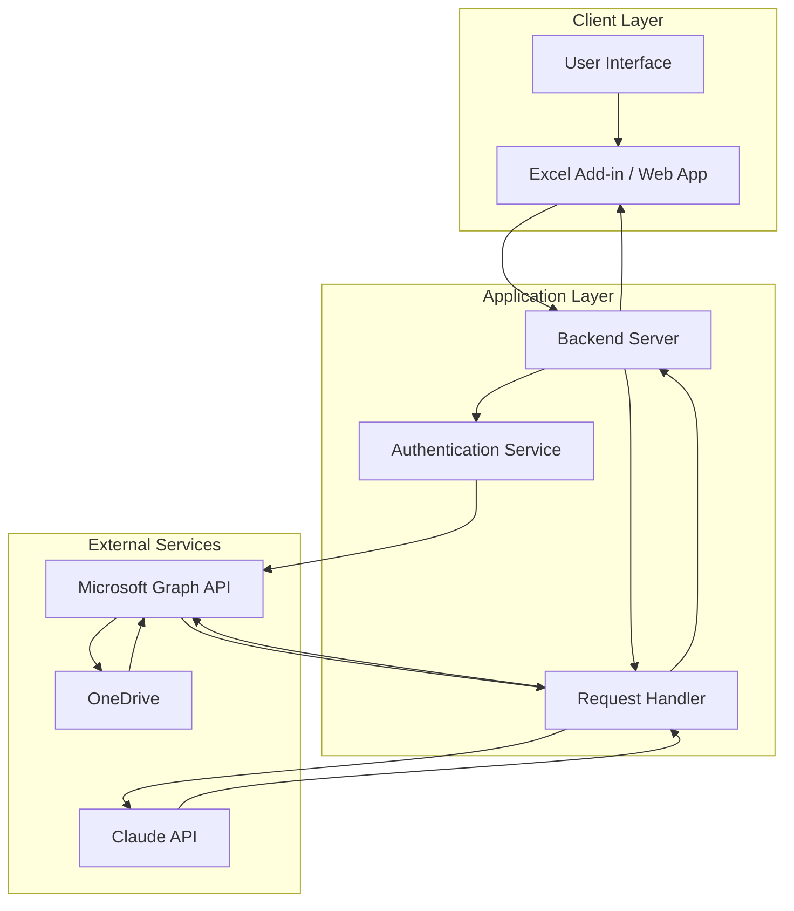
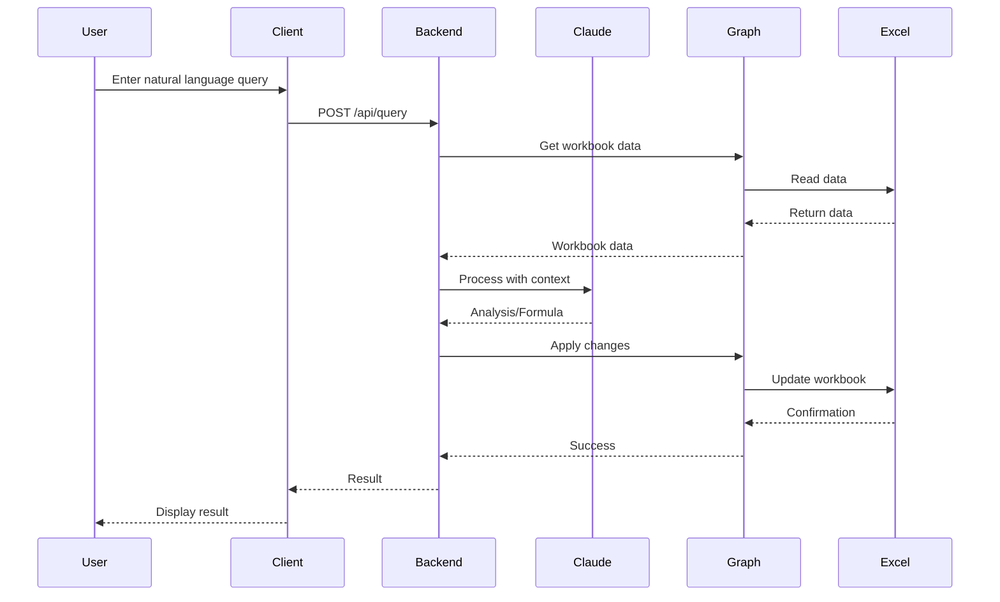
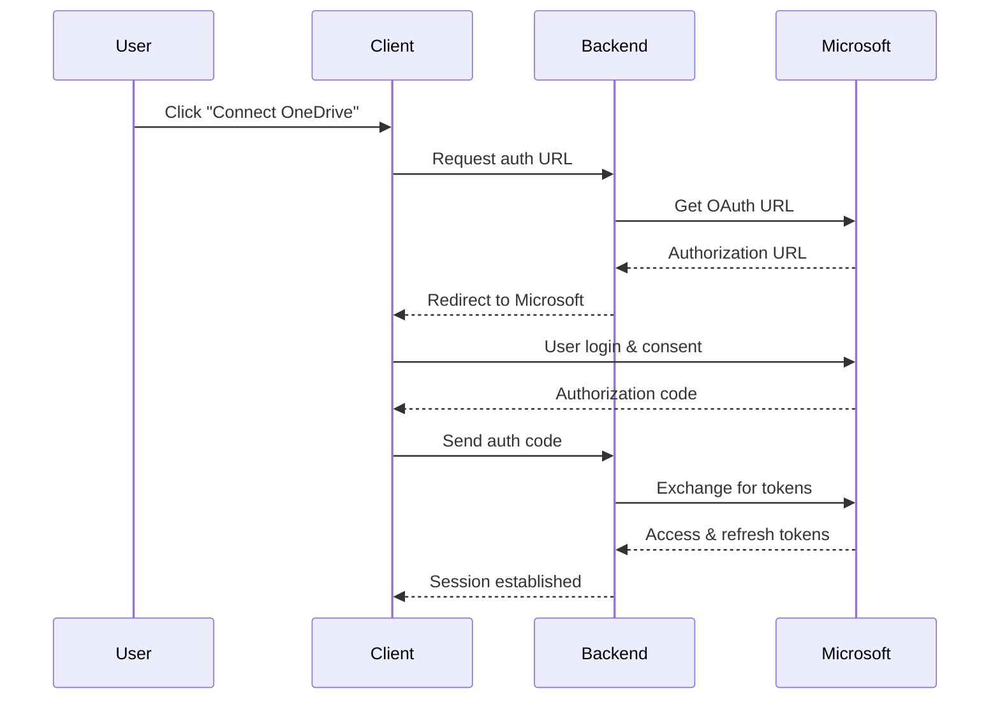

## System Architecture

The Excel-Claude Integration follows a modern, API-driven architecture that connects Claude's AI capabilities with Microsoft Excel through secure, cloud-based services.

## Architecture Diagram



## Core Components

### 1. Client Layer

<AccordionGroup>
  <Accordion title="Excel Add-in" icon="table">
    The Excel add-in provides the user interface within Excel:

    - Custom task pane for Claude interactions
    - Formula suggestions and auto-completion
    - Data visualization tools
    - Built using Office.js and React
  </Accordion>

  <Accordion title="Web Application" icon="browser">
    Standalone web interface for Excel file management:

    - Browse and select Excel files from OneDrive
    - Preview spreadsheet data
    - Submit queries to Claude
    - View and export results
  </Accordion>
</AccordionGroup>

### 2. Application Layer

<AccordionGroup>
  <Accordion title="Backend Server" icon="server">
    Node.js/Express server handling:

    - API request routing
    - Session management
    - Rate limiting and caching
    - Error handling and logging
  </Accordion>

  <Accordion title="Authentication Service" icon="lock">
    OAuth 2.0 implementation:

    - Microsoft identity platform integration
    - Token management and refresh
    - Permission scopes handling
    - Secure credential storage
  </Accordion>

  <Accordion title="Request Handler" icon="exchange">
    Orchestrates interactions:

    - Parses user requests
    - Formats data for Claude API
    - Processes Claude responses
    - Translates actions to Excel operations
  </Accordion>
</AccordionGroup>

### 3. External Services

<AccordionGroup>
  <Accordion title="Claude API" icon="brain">
    Anthropic's Claude API provides:

    - Natural language understanding
    - Formula generation
    - Data analysis and insights
    - Text processing and transformation
  </Accordion>

  <Accordion title="Microsoft Graph API" icon="cloud">
    Microsoft Graph enables:

    - Secure file access
    - Workbook manipulation
    - Real-time data updates
    - Permission management
  </Accordion>

  <Accordion title="OneDrive" icon="folder">
    Cloud storage for:

    - Excel workbook storage
    - File versioning
    - Collaborative editing
    - Cross-device access
  </Accordion>
</AccordionGroup>

## Data Flow

### Query Processing Flow



### Authentication Flow



## Security Considerations

<Warning>
  All data transmission is encrypted using TLS 1.3. API keys and tokens are stored securely using industry-standard encryption.
</Warning>

### Authentication & Authorization
- OAuth 2.0 with PKCE flow
- Minimal permission scopes
- Token rotation and expiration
- Secure token storage

### Data Privacy
- No persistent data storage
- In-memory processing only
- User data never shared
- GDPR and SOC 2 compliant

### API Security
- Rate limiting per user
- Request validation
- Input sanitization
- Error message obfuscation

## Technology Stack

<CardGroup cols={2}>
  <Card title="Frontend" icon="desktop">
    - React 18
    - TypeScript
    - Office.js
    - Tailwind CSS
  </Card>

  <Card title="Backend" icon="server">
    - Node.js 20
    - Express.js
    - TypeScript
    - Redis (caching)
  </Card>

  <Card title="APIs" icon="plug">
    - Claude API (Anthropic)
    - Microsoft Graph API
    - Excel REST API
  </Card>

  <Card title="Infrastructure" icon="cloud">
    - Azure App Service
    - Azure Key Vault
    - Azure Monitor
    - GitHub Actions
  </Card>
</CardGroup>

## Performance Optimization

### Caching Strategy
- Workbook metadata cached for 5 minutes
- Claude responses cached for identical queries
- User session data in Redis

### Request Optimization
- Batch Graph API calls when possible
- Lazy load workbook data
- Streaming responses for large datasets

### Scalability
- Horizontal scaling with load balancer
- Stateless backend architecture
- Database connection pooling
- CDN for static assets

## Error Handling

The system implements comprehensive error handling:

<CodeGroup>
```javascript Network Errors
try {
  const response = await fetch(API_ENDPOINT);
  if (!response.ok) {
    throw new NetworkError('API request failed');
  }
} catch (error) {
  if (error instanceof NetworkError) {
    // Retry with exponential backoff
    await retryWithBackoff(fetchData);
  }
}
```

```javascript API Errors
// Claude API rate limiting
if (error.status === 429) {
  const retryAfter = error.headers['retry-after'];
  await sleep(retryAfter * 1000);
  return retryRequest();
}

// Authentication errors
if (error.status === 401) {
  await refreshAuthToken();
  return retryRequest();
}
```
</CodeGroup>

## Monitoring & Logging

### Application Insights
- Request telemetry
- Performance metrics
- Error tracking
- User analytics

### Logging Levels
- **INFO**: Successful operations
- **WARN**: Handled exceptions
- **ERROR**: Unhandled errors
- **DEBUG**: Detailed traces (dev only)

## Next Steps

<CardGroup cols={2}>
  <Card title="OneDrive Setup" icon="cloud" href="/excel-onedrive-setup">
    Configure Microsoft OneDrive integration
  </Card>

  <Card title="API Reference" icon="code" href="/excel-claude-api">
    Explore API endpoints and usage
  </Card>
</CardGroup>
