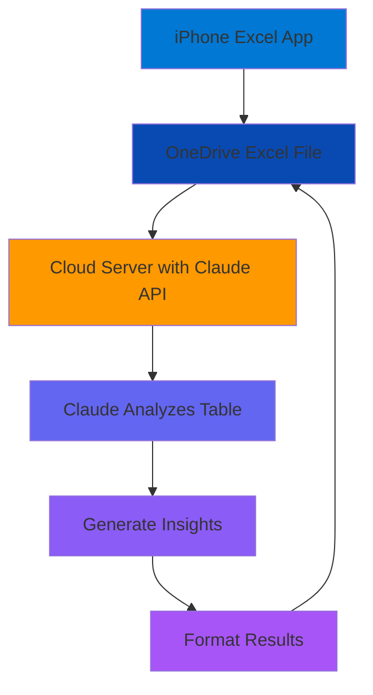

## System Architecture

The Excel-Claude integration uses a cloud-based middleware architecture to connect OneDrive Excel files with Claude's AI capabilities.

## Architecture Diagram



## Components

<CardGroup cols={2}>
  <Card title="Client Layer" icon="mobile">
    Excel apps (iPhone, iPad, Desktop, Web) that access OneDrive files
  </Card>
  <Card title="Storage Layer" icon="cloud">
    OneDrive/SharePoint storing Excel files with table data
  </Card>
  <Card title="Middleware Layer" icon="server">
    Cloud server orchestrating data flow and API calls
  </Card>
  <Card title="AI Layer" icon="brain">
    Claude API processing and analyzing Excel data
  </Card>
</CardGroup>

## Data Flow

### 1. File Access

The cloud server accesses Excel files from OneDrive using Microsoft Graph API:

```javascript
// Authenticate with Microsoft Graph
const accessToken = await getAccessToken();

// Read Excel file
const workbookData = await fetch(
  'https://graph.microsoft.com/v1.0/me/drive/items/{file-id}/workbook',
  {
    headers: { 'Authorization': `Bearer ${accessToken}` }
  }
);
```

### 2. Data Extraction

Extract table data from Excel worksheets:

```javascript
// Get worksheet data
const worksheet = await fetch(
  'https://graph.microsoft.com/v1.0/me/drive/items/{file-id}/workbook/worksheets/Sheet1/usedRange',
  {
    headers: { 'Authorization': `Bearer ${accessToken}` }
  }
);

const tableData = await worksheet.json();
```

### 3. Claude Analysis

Send extracted data to Claude for analysis:

```javascript
const anthropic = new Anthropic({
  apiKey: process.env.ANTHROPIC_API_KEY
});

const message = await anthropic.messages.create({
  model: "claude-sonnet-4-5-20250929",
  max_tokens: 4096,
  messages: [{
    role: "user",
    content: `Analyze this Excel table data and provide insights:

${JSON.stringify(tableData.values, null, 2)}`
  }]
});
```

### 4. Write Results

Update Excel file with Claude's analysis:

```javascript
// Write results to new worksheet or cell range
await fetch(
  'https://graph.microsoft.com/v1.0/me/drive/items/{file-id}/workbook/worksheets/Analysis/range(address=\'A1\')',
  {
    method: 'PATCH',
    headers: {
      'Authorization': `Bearer ${accessToken}`,
      'Content-Type': 'application/json'
    },
    body: JSON.stringify({
      values: [[message.content[0].text]]
    })
  }
);
```

## Security Architecture

<Steps>
  <Step title="Authentication">
    Uses OAuth 2.0 for Microsoft Graph API and API keys for Claude
  </Step>
  <Step title="Data in Transit">
    All communication uses HTTPS/TLS encryption
  </Step>
  <Step title="Credential Storage">
    API keys and tokens stored in secure environment variables
  </Step>
  <Step title="Access Control">
    OneDrive permissions control which files can be accessed
  </Step>
</Steps>

## Deployment Options

### Option 1: Serverless (Recommended)

Deploy on serverless platforms for automatic scaling and cost efficiency:

<Tabs>
  <Tab title="AWS Lambda">
    ```yaml
    service: excel-claude-integration

    provider:
      name: aws
      runtime: nodejs18.x
      environment:
        ANTHROPIC_API_KEY: ${env:ANTHROPIC_API_KEY}
        MICROSOFT_CLIENT_ID: ${env:MICROSOFT_CLIENT_ID}
        MICROSOFT_CLIENT_SECRET: ${env:MICROSOFT_CLIENT_SECRET}

    functions:
      analyzeExcel:
        handler: handler.analyzeExcel
        events:
          - http:
              path: analyze
              method: post
    ```
  </Tab>
  <Tab title="Azure Functions">
    ```json
    {
      "bindings": [
        {
          "type": "httpTrigger",
          "direction": "in",
          "name": "req",
          "methods": ["post"],
          "route": "analyze"
        },
        {
          "type": "http",
          "direction": "out",
          "name": "res"
        }
      ]
    }
    ```
  </Tab>
  <Tab title="Vercel">
    ```javascript
    // api/analyze.js
    export default async function handler(req, res) {
      // Integration logic here
      const result = await analyzeExcelWithClaude(req.body);
      res.status(200).json(result);
    }
    ```
  </Tab>
</Tabs>

### Option 2: Container-based

Deploy using Docker for more control:

```dockerfile
FROM node:18-alpine

WORKDIR /app

COPY package*.json ./
RUN npm ci --production

COPY . .

ENV PORT=3000
EXPOSE 3000

CMD ["node", "server.js"]
```

### Option 3: Traditional Server

Deploy on VPS or cloud VM:

- AWS EC2
- Azure Virtual Machines
- Google Compute Engine
- DigitalOcean Droplets

## Performance Considerations

<AccordionGroup>
  <Accordion title="Caching Strategy">
    **File Caching**: Cache Excel file content to reduce OneDrive API calls

    **Result Caching**: Store Claude analysis results for frequently accessed data

    ```javascript
    const cache = new Map();
    const cacheKey = `${fileId}_${lastModified}`;

    if (cache.has(cacheKey)) {
      return cache.get(cacheKey);
    }
    ```
  </Accordion>

  <Accordion title="Batch Processing">
    **Multiple Tables**: Process multiple worksheets in a single Claude request

    **Chunking**: Split large datasets into manageable chunks

    ```javascript
    const chunks = chunkArray(tableData, 1000);
    const results = await Promise.all(
      chunks.map(chunk => analyzeWithClaude(chunk))
    );
    ```
  </Accordion>

  <Accordion title="Rate Limiting">
    **Microsoft Graph**: 10,000 requests per 10 minutes per app

    **Claude API**: Varies by tier, implement exponential backoff

    ```javascript
    const retry = async (fn, maxRetries = 3) => {
      for (let i = 0; i < maxRetries; i++) {
        try {
          return await fn();
        } catch (error) {
          if (i === maxRetries - 1) throw error;
          await sleep(Math.pow(2, i) * 1000);
        }
      }
    };
    ```
  </Accordion>
</AccordionGroup>

## Scalability

The architecture supports horizontal scaling:

- **Stateless Design**: Each request is independent
- **Load Balancing**: Distribute requests across multiple instances
- **Auto-scaling**: Automatically adjust capacity based on demand
- **Queue-based Processing**: Use message queues for async analysis

```javascript
// Example with AWS SQS
const { SQSClient, SendMessageCommand } = require("@aws-sdk/client-sqs");

async function queueAnalysis(fileId, worksheetName) {
  const command = new SendMessageCommand({
    QueueUrl: process.env.QUEUE_URL,
    MessageBody: JSON.stringify({ fileId, worksheetName })
  });

  await sqsClient.send(command);
}
```

## Error Handling

Implement robust error handling at each layer:

```javascript
class ExcelClaudeError extends Error {
  constructor(message, layer, originalError) {
    super(message);
    this.layer = layer;
    this.originalError = originalError;
  }
}

async function analyzeExcel(fileId) {
  try {
    // 1. Access file
    const data = await getExcelData(fileId);
  } catch (error) {
    throw new ExcelClaudeError(
      'Failed to access Excel file',
      'storage',
      error
    );
  }

  try {
    // 2. Analyze with Claude
    const analysis = await claudeAnalyze(data);
  } catch (error) {
    throw new ExcelClaudeError(
      'Failed to analyze data',
      'ai',
      error
    );
  }

  try {
    // 3. Write results
    await writeResults(fileId, analysis);
  } catch (error) {
    throw new ExcelClaudeError(
      'Failed to write results',
      'storage',
      error
    );
  }
}
```

## Monitoring & Logging

<CardGroup cols={2}>
  <Card title="Request Logging" icon="list">
    Log all API requests for debugging and analytics
  </Card>
  <Card title="Error Tracking" icon="bug">
    Use Sentry or similar for error monitoring
  </Card>
  <Card title="Performance Metrics" icon="gauge">
    Track response times and throughput
  </Card>
  <Card title="Cost Monitoring" icon="dollar-sign">
    Monitor API usage and costs
  </Card>
</CardGroup>

## Next Steps

<CardGroup cols={2}>
  <Card title="OneDrive Setup" icon="cloud" href="/excel-onedrive-setup">
    Configure OneDrive API access
  </Card>
  <Card title="Claude Integration" icon="brain" href="/excel-claude-api">
    Implement Claude API calls
  </Card>
</CardGroup>
