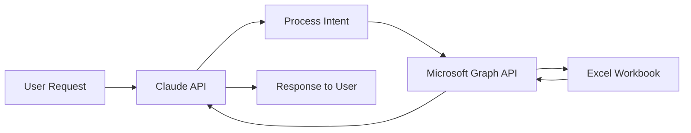

## Overview

The Excel-Claude Integration enables you to leverage Claude's advanced AI capabilities directly within Microsoft Excel. This integration allows you to:

- Analyze complex datasets with natural language queries
- Generate formulas and visualizations automatically
- Automate repetitive data processing tasks
- Extract insights from spreadsheet data
- Transform and clean data intelligently

## Key Features

<CardGroup cols={2}>
  <Card title="Natural Language Queries" icon="message">
    Ask questions about your data in plain English and get instant insights
  </Card>

  <Card title="Formula Generation" icon="function">
    Describe what you want to calculate and Claude will generate the formula
  </Card>

  <Card title="Data Transformation" icon="arrows-rotate">
    Clean, transform, and restructure data with AI assistance
  </Card>

  <Card title="OneDrive Integration" icon="cloud">
    Seamlessly access and modify Excel files stored in OneDrive
  </Card>
</CardGroup>

## How It Works

The integration leverages three key technologies:

1. **Claude API** - Anthropic's advanced AI for natural language understanding and generation
2. **Microsoft Graph API** - Secure access to Excel files in OneDrive
3. **Excel JavaScript API** - Programmatic interaction with Excel workbooks

## Use Cases

### Data Analysis
Ask Claude to analyze trends, identify outliers, or summarize large datasets without writing complex formulas.

### Formula Assistance
Describe calculations in natural language and Claude generates the appropriate Excel formulas.

### Report Generation
Automatically generate summaries, charts, and formatted reports from raw data.

### Data Cleaning
Identify and fix inconsistencies, duplicates, and formatting issues in your spreadsheets.

## Getting Started

<Steps>
  <Step title="Set up OneDrive">
    Configure Microsoft OneDrive access and permissions

    [Learn more →](/excel-onedrive-setup)
  </Step>

  <Step title="Get Claude API Key">
    Obtain your API key from the Anthropic Console

    [Get API Key](https://console.anthropic.com)
  </Step>

  <Step title="Understand the Architecture">
    Learn how the components work together

    [View Architecture →](/excel-architecture)
  </Step>

  <Step title="Explore Examples">
    Try out common use cases and examples

    [See Examples →](/excel-examples)
  </Step>
</Steps>

## Requirements

- Microsoft 365 account with OneDrive access
- Claude API key (available at [console.anthropic.com](https://console.anthropic.com))
- Basic understanding of Excel and spreadsheet concepts

## Next Steps

<CardGroup cols={2}>
  <Card title="Architecture" icon="diagram-project" href="/excel-architecture">
    Understand the technical architecture
  </Card>

  <Card title="OneDrive Setup" icon="cloud" href="/excel-onedrive-setup">
    Configure OneDrive integration
  </Card>

  <Card title="API Reference" icon="code" href="/excel-claude-api">
    Explore the API endpoints
  </Card>

  <Card title="Examples" icon="lightbulb" href="/excel-examples">
    View practical examples
  </Card>
</CardGroup>
