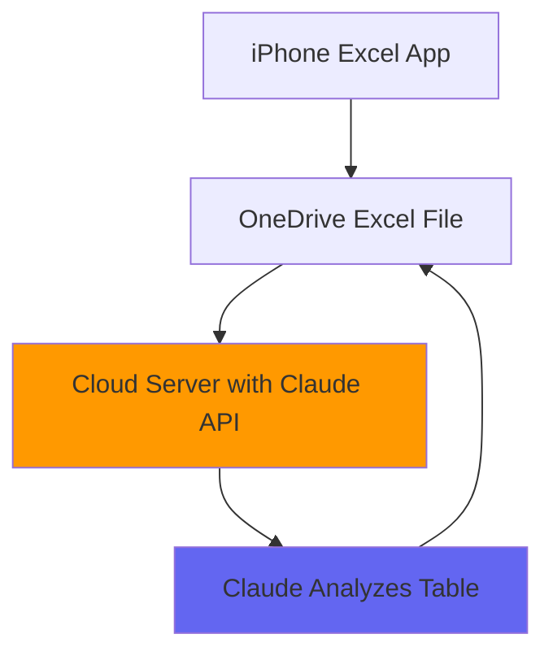

## Overview

Integrate Claude's powerful AI capabilities directly into your Excel workflows using OneDrive and the Claude API. This integration enables automated analysis, data processing, and intelligent insights from your spreadsheet data.

<Card
  title="Architecture Overview"
  icon="diagram-project"
  href="/excel-architecture"
>
  Understand the system architecture and data flow
</Card>

## Key Features

<CardGroup cols={2}>
  <Card title="Real-time Analysis" icon="bolt">
    Claude analyzes your Excel data in real-time via cloud integration
  </Card>
  <Card title="OneDrive Integration" icon="cloud">
    Seamlessly works with Excel files stored in OneDrive
  </Card>
  <Card title="Mobile Support" icon="mobile">
    Access from iPhone Excel app or any device with OneDrive access
  </Card>
  <Card title="Automated Workflows" icon="robot">
    Set up automated data processing and analysis pipelines
  </Card>
</CardGroup>

## Use Cases

- **Financial Analysis**: Analyze financial statements, budgets, and forecasts
- **Data Cleaning**: Identify and fix data quality issues automatically
- **Report Generation**: Generate summaries and insights from raw data
- **Pattern Detection**: Discover trends and anomalies in datasets
- **Formula Optimization**: Get suggestions for complex Excel formulas

## How It Works



1. **Store**: Save your Excel file to OneDrive
2. **Connect**: Cloud server accesses the file via OneDrive API
3. **Analyze**: Claude processes the table data using Frontier models
4. **Update**: Results are written back to the Excel file

## Getting Started

<Steps>
  <Step title="Set up OneDrive Access">
    Configure OneDrive API credentials and permissions

    [OneDrive Setup Guide →](/excel-onedrive-setup)
  </Step>

  <Step title="Configure Claude API">
    Get your Claude API key and configure the integration

    [Claude API Setup →](/excel-claude-api)
  </Step>

  <Step title="Deploy Cloud Server">
    Set up the middleware server to connect OneDrive and Claude

    [Implementation Guide →](/excel-implementation)
  </Step>
</Steps>

## Supported Models

This integration works with Claude's latest Frontier models:

| Model | Best For | Context Window |
|-------|----------|----------------|
| Claude Sonnet 4.5 | Balanced performance and speed | 200K tokens |
| Claude Opus 4 | Complex analysis and reasoning | 200K tokens |
| Claude Haiku 4 | Fast, cost-effective processing | 200K tokens |

## Requirements

<AccordionGroup>
  <Accordion title="OneDrive Account">
    - Microsoft 365 subscription or free OneDrive account
    - OneDrive API access (free for development)
    - Excel files stored in OneDrive
  </Accordion>

  <Accordion title="Claude API Access">
    - Anthropic API account
    - API key with sufficient credits
    - Access to Claude 3.5 Sonnet or newer models
  </Accordion>

  <Accordion title="Cloud Infrastructure">
    - Node.js 18+ or Python 3.9+ runtime
    - HTTPS-enabled server or serverless platform
    - Environment variables for secure credential storage
  </Accordion>
</AccordionGroup>

## Quick Example

Here's a simple example of analyzing an Excel table with Claude:

```python
import anthropic
from office365.sharepoint.client_context import ClientContext

# Connect to OneDrive and read Excel file
excel_data = read_excel_from_onedrive("financial_report.xlsx")

# Send to Claude for analysis
client = anthropic.Anthropic(api_key="your-api-key")
message = client.messages.create(
    model="claude-sonnet-4-5-20250929",
    max_tokens=4096,
    messages=[{
        "role": "user",
        "content": f"Analyze this financial data: {excel_data}"
    }]
)

# Write results back to Excel
write_analysis_to_excel(message.content, "financial_report.xlsx")
```

## Next Steps

<CardGroup cols={2}>
  <Card title="Architecture Details" icon="sitemap" href="/excel-architecture">
    Deep dive into the system architecture
  </Card>
  <Card title="OneDrive Setup" icon="cloud" href="/excel-onedrive-setup">
    Configure OneDrive API access
  </Card>
  <Card title="Claude API Integration" icon="brain" href="/excel-claude-api">
    Implement Claude API calls
  </Card>
  <Card title="Code Examples" icon="code" href="/excel-examples">
    Complete implementation examples
  </Card>
</CardGroup>

## Support

<Info>
  This integration uses the official Anthropic Claude API and Microsoft Graph API.
  Refer to their respective documentation for detailed API references.
</Info>

- [Anthropic Claude API Documentation](https://docs.anthropic.com)
- [Microsoft Graph API Documentation](https://learn.microsoft.com/en-us/graph/)
- [OneDrive API Reference](https://learn.microsoft.com/en-us/onedrive/developer/)
